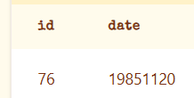
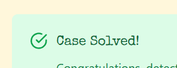

# Setting the scene

We are given the following text to set the mood of our first case;

```txt
Set in the gritty 1980s, a valuable briefcase has disappeared from the Blue Note Lounge. A witness reported that a man in a trench coat was seen fleeing the scene. Investigate the crime scene, review the list of suspects, and examine interview transcripts to reveal the culprit.
```
## Initial Information
From this we can gather a handful of information to begin our investigation:
 - Location: Blue Note Lounge
 - Item: Briefcase
 - Crime: Theft
 - year: 1980's
 - Suspect attire: man in a trenchcoat fleeing the scene
## The databases
1. crime_scene
    - id
    - date
    - type
    - location
2. suspects
	- id
	- name
	- attire
	- scar
3. interviews
	- suspect_id
	- transcript


# The investigation
Given the list of information from the briefing let's get the full crime scene information  (in case more relevant information comes out, good habits start here), From the schema given we can pull the following information from a query:
- id (this is the crime scene id)
- date (this is in the format yyyymmdd)

## Crime Scene start
```sql
select * from crime_scene where location = "Blue Note Lounge";
```



The case ID returned is 76, and the date is revealed to be 19851120; there is also additional information about the suspect that is revealed.
```txt
Description:

A briefcase containing sensitive documents vanished. A witness reported a man in a trench coat with a scar on his left cheek fleeing the scene.
```
## Narrowing down the suspects
He has a scar on his left cheek! so now we have attire (trench coat) and scar (left cheek), which can help narrow the suspects down. So lets formulate a query to do just that.

```sql
select * from suspects where attire = "trench coat" and scar = "left cheek";
```

> [!note]
> With SQL we can combine multiple statements in order to narrow down information, in the query above, we are searching for a distinct pair of information -- attire and scar -- so we use `and` to tell sql to only return information where both return true. `Or` statements on the other hand only require one of the statements to be true, which can leave us with far more information or narrowing down to do.

This returns us 2 suspects:
1. Frankie Lombardi
	- suspect_id = 3
2. Vincent Malone
	- suspect_id = 183

## Let's find out whodunnit
Since this list is small we can do one of two queries to get the interviews from the individuals, in other cases I'll show how to get SQL to output the info in a csv format.
We can either do a quick comma separated list (3,183) or we can query individually. I'm going to opt for using the comma separated list method.
```sql
select * from interviews where suspect_id in (3,183)
```

| suspect_id | transcript                             |
| ---------- | -------------------------------------- |
| 3          | NULL                                   |
| 183        | I wasn’t going to steal it, but I did. |

## Submit and...
Well, That's convenient. You'll find out that the suspects typically admit they did it in their confession/interviews, now let's just submit suspect 183 - Vincent as the answer and... 

> [!note] 
> The answer field is expecting the full name, not partial. 




# Final thoughts on the case

I found the case to be a simple, yet an effective way to showcase how you can cross-reference databases in order to narrow down information. With only 3 databases to sift through, it makes it a lot easier to find and cross-reference data. 
We utilized the initial case information regarding the location to get information about the crime scene. This revealed additional information about the suspect, which allowed us to narrow down the list. From our narrowed down list we were able to pinpoint the suspect, who admitted to the crime.

Thanks for reading and hopefully following along in order to solve this case, stay savvy detectives.

```
  .OOOOOOOOOOOOOOO @@         D i c k  T r a c y        @@ OOOOOOOOOOOOOOOO.
  OOOOOOOOOOOOOOOO @@                                    @@ OOOOOOOOOOOOOOOO
  OOOOOOOOOO'''''' @@                                    @@ ```````OOOOOOOOO
  OOOOO'' aaa@@@@@@@@@@@@@@@@@@@@"""                   """""""""@@aaaa `OOOO
  OOOOO,""""@@@@@@@@@@@@@@""""                                     a@"" OOOA
  OOOOOOOOOoooooo,                                            |OOoooooOOOOOS
  OOOOOOOOOOOOOOOOo,            I'll be selling the           |OOOOOOOOOOOOC
  OOOOOOOOOOOOOOOOOO            house and moving my          ,|OOOOOOOOOOOOI
  OOOOOOOOOOOOOOOOOO @           family to a condo           |OOOOOOOOOOOOOI
  OOOOOOOOOOOOOOOOO'@           complex with a pool          OOOOOOOOOOOOOOb
  OOOOOOOOOOOOOOO'a'            & where someone else         |OOOOOOOOOOOOOy
  OOOOOOOOOOOOOO''              mows the grass!           aa`OOOOOOOOOOOP
  OOOOOOOOOOOOOOb,..            Things here will be           `@aa``OOOOOOOh
  OOOOOOOOOOOOOOOOOOo           hectic for the next             `@@@aa OOOOo
  OOOOOOOOOOOOOOOOOOO|          6 weeks or so.                     @@@ OOOOe
  OOOOOOOOOOOOOOOOOOO@                               aaaaaaa       @@',OOOOn
  OOOOOOOOOOOOOOOOOOO@                        aaa@@@@@@@@""        @@ OOOOOi
  OOOOOOOOOO~~ aaaaaa"a                 aaa@@@@@@@@@@""            @@ OOOOOx
  OOOOOO aaaa@"""""""" ""            @@@@@@@@@@@@""               @@@|`OOOO'
  OOOOOOOo`@@a                  aa@@  @@@@@@@""         a@        @@@@ OOOO9
  OOOOOOO'  `@@a               @@a@@   @@""           a@@   a     |@@@ OOOO3
  `OOOO'       `@    aa@@       aaa"""          @a        a@     a@@@',OOOO'

```
(credit Roy Sussman for the ascii)
