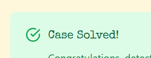

# Setting the Scene

The following text sets the scene
```txt
At Miami’s prestigious Fontainebleau Hotel charity gala, the famous “Heart of Atlantis” diamond necklace suddenly disappeared from its display.
```

## Initial Information
- location: Fontainbleau Hotel
- type: theft
- item: "Heart of Atlantis"

## The Databases

- crime_scene:
  
  |Column|Type|
  |---|---|
  |id|INTEGER|
  |date|INTEGER|
  |location|TEXT|
  |description|TEXT|
  
- guest:
  
  |Column|Type|
  |---|---|
  |id|INTEGER|
  |name|TEXT|
  |occupation|TEXT|
  |invitation_code|TEXT|
  
- witness_statements:
  
  |Column|Type|
  |---|---|
  |id|INTEGER|
  |guest_id|INTEGER|
  |clue|TEXT|
  
- attire_registry:
  
  |Column|Type|
  |---|---|
  |id|INTEGER|
  |guest_id|INTEGER|
  |note|TEXT|
  
- marina_rentals:
  
  |Column|Type|
  |---|---|
  |id|INTEGER|
  |dock_number|INTEGER|
  |renter_guest_id|INTEGER|
  |rental_date|INTEGER|
  |boat_name|TEXT|
  
- final_interviews:
  
  |Column|Type|
  |---|---|
  |id|INTEGER|
  |guest_id|INTEGER|
  |confession|TEXT|
  
# The Investigation

## The crime scene
As with any investigation, we pull up our investigative files on it

| id  | date     | location            | description                                                                                                                                                                                                                                                     |
| --- | -------- | ------------------- | --------------------------------------------------------------------------------------------------------------------------------------------------------------------------------------------------------------------------------------------------------------- |
| 48  | 19870520 | Fontainebleau Hotel | The Heart of Atlantis necklace disappeared. Many guests were questioned but only two of them gave valuable clues. One of them is a really famous actor. The other one is a woman who works as a consultant for a big company and her first name ends with "an". |

### Intel
- only two guests gave valuable clues
	- one is a famous actor
	- the other is a consultant and her first name ends in "an"

Let's gather some more information about our guests, shall we?

We'll be utilizing the occupation column from the guests list, alongside the name field where we'll use our fuzzy matching

```mysql
select * from guest where occupation = "Actor" or (occupation = "Consultant" and name like "%an %")
```
>[!note]
>We include the space after "an" because we were informed that the Consultant's first name ends in "an"

## Guest List

|id|name|occupation|invitation_code|
|---|---|---|---|
|43|Ruby Baker|Actor|VIP-R|
|116|Vivian Nair|Consultant|VIP-R|
|129|Clint Eastwood|Actor|VIP-G|
|164|River Bowers|Actor|VIP-B|
|189|Sage Dillon|Actor|VIP-G|
|192|Phoenix Pitts|Actor|VIP-G|

Looks like we're in luck, The only consultant who's first name ends in "an" is Vivian Nair, id 116. And the only famous actor on the list is Clint Eastwood, id129. So, let's see what they have to say about the incident.

## Witness Statements

```mysql
select clue from witness_statements where guest_id in (116,129);
```

| clue                                                                                              |
| ------------------------------------------------------------------------------------------------- |
| I saw someone holding an invitation ending with "-R". He was wearing a navy suit and a white tie. |
| I overheard someone say, "Meet me at the marina, dock 3.                                          |

### New Intel
- Invitation ends in "-R"
- attire is "navy suit" and "white tie"
- Marina, dock 3

Let's see if we can correlate some data!
-  "marina_rentals" can utilize guest_id, dock #, and date 
-  "attire_registry" can utilize guest_id and attire information
-  "guest" can supply the name and invitation.
-  for convenience, let's also just supply the "final_interview"

Let's craft an SQL query that can satisfy the conditions above

```mysql
select guest.id, guest.name, guest.invitation_code, attire_registry.note, final_interviews.confession -- All the general information about the guest
from guest -- start here
inner join attire_registry on attire_registry.guest_id = guest.id -- line things up with guest id
inner join marina_rentals on marina_rentals.renter_guest_id = guest.id -- line things up with guest id
inner join final_interviews on final_interviews.guest_id = guest.id -- line things up with guest id
where guest.invitation_code like "%-R" and attire_registry.note like "%Navy Suit%" and attire_registry.note like "%White Tie%" and marina_rentals.dock = 3 and marina_rentals.rental_date = 19870520 -- combining all the important information from our clues, Invitation ends in -R, Navy Suit and White Tie, dock 3, and rental date 19870520 (the date of the crime)
```
> [!note]
> Not all the information may be used, however it's best to narrow down things as much as possible.

| id  | name         | invitation_code | note                 | confession                                                       |
| --- | ------------ | --------------- | -------------------- | ---------------------------------------------------------------- |
| 105 | Mike Manning | VIP-R           | navy suit, white tie | I was the one who took the crystal. I guess I need a lawyer now? |

"Crystal" can be another name for a diamond. Looks like Mike is our culprit



# Closing Thoughts
Hello Detectives, as of the writing of this, this is the last case so far. But it was still exhilarating to work through let's hope in the future the cases are just as fun and exciting to work through. 

Stay Savvy, Detectives

---
```
  .OOOOOOOOOOOOOOO @@         D i c k  T r a c y        @@ OOOOOOOOOOOOOOOO.
  OOOOOOOOOOOOOOOO @@                                    @@ OOOOOOOOOOOOOOOO
  OOOOOOOOOO'''''' @@                                    @@ ```````OOOOOOOOO
  OOOOO'' aaa@@@@@@@@@@@@@@@@@@@@"""                   """""""""@@aaaa `OOOO
  OOOOO,""""@@@@@@@@@@@@@@""""                                     a@"" OOOA
  OOOOOOOOOoooooo,                                            |OOoooooOOOOOS
  OOOOOOOOOOOOOOOOo,            I'll be selling the           |OOOOOOOOOOOOC
  OOOOOOOOOOOOOOOOOO            house and moving my          ,|OOOOOOOOOOOOI
  OOOOOOOOOOOOOOOOOO @           family to a condo           |OOOOOOOOOOOOOI
  OOOOOOOOOOOOOOOOO'@           complex with a pool          OOOOOOOOOOOOOOb
  OOOOOOOOOOOOOOO'a'            & where someone else         |OOOOOOOOOOOOOy
  OOOOOOOOOOOOOO''              mows the grass!           aa`OOOOOOOOOOOP
  OOOOOOOOOOOOOOb,..            Things here will be           `@aa``OOOOOOOh
  OOOOOOOOOOOOOOOOOOo           hectic for the next             `@@@aa OOOOo
  OOOOOOOOOOOOOOOOOOO|          6 weeks or so.                     @@@ OOOOe
  OOOOOOOOOOOOOOOOOOO@                               aaaaaaa       @@',OOOOn
  OOOOOOOOOOOOOOOOOOO@                        aaa@@@@@@@@""        @@ OOOOOi
  OOOOOOOOOO~~ aaaaaa"a                 aaa@@@@@@@@@@""            @@ OOOOOx
  OOOOOO aaaa@"""""""" ""            @@@@@@@@@@@@""               @@@|`OOOO'
  OOOOOOOo`@@a                  aa@@  @@@@@@@""         a@        @@@@ OOOO9
  OOOOOOO'  `@@a               @@a@@   @@""           a@@   a     |@@@ OOOO3
  `OOOO'       `@    aa@@       aaa"""          @a        a@     a@@@',OOOO'

```
(credit Roy Sussman for the ascii)